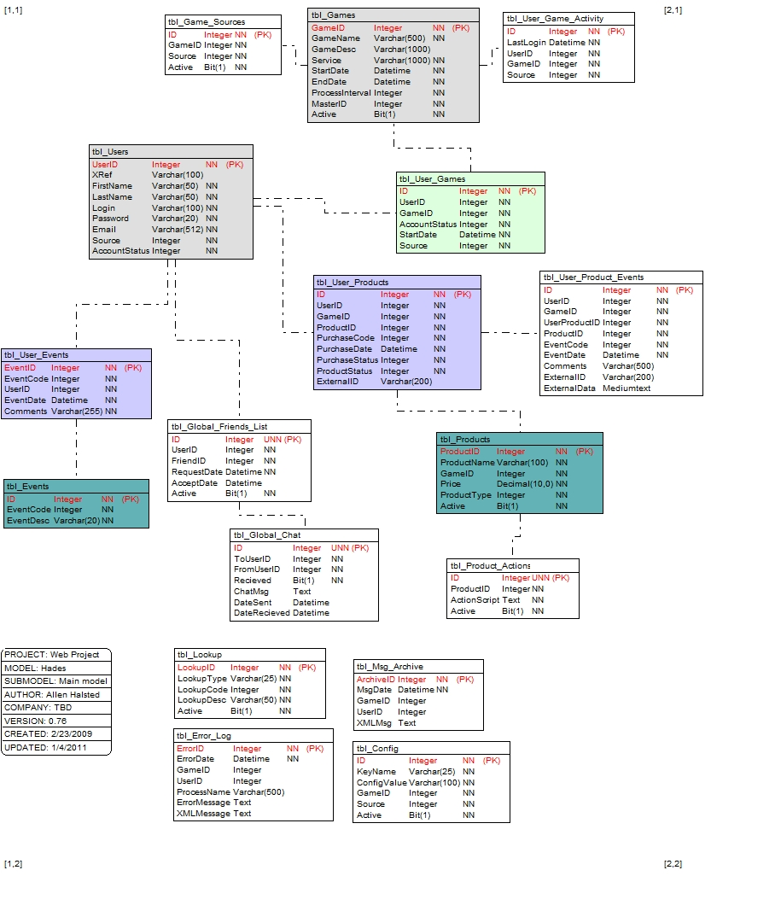
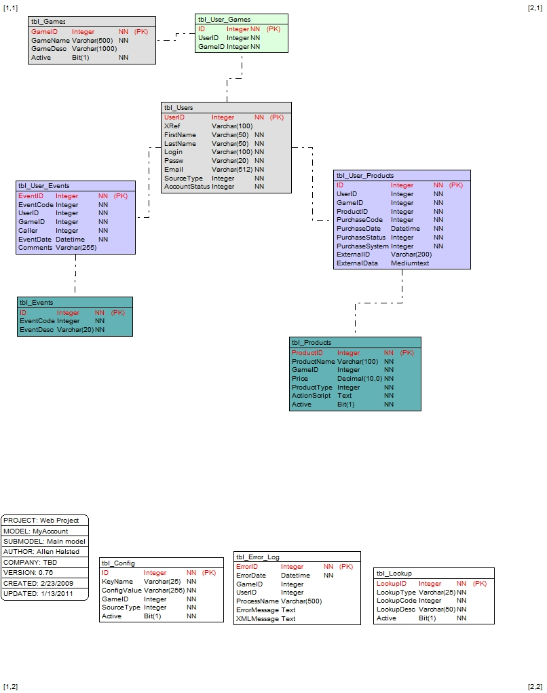
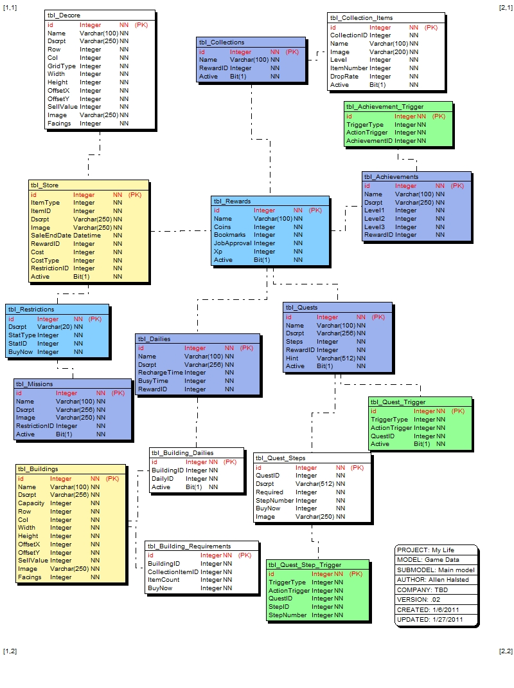
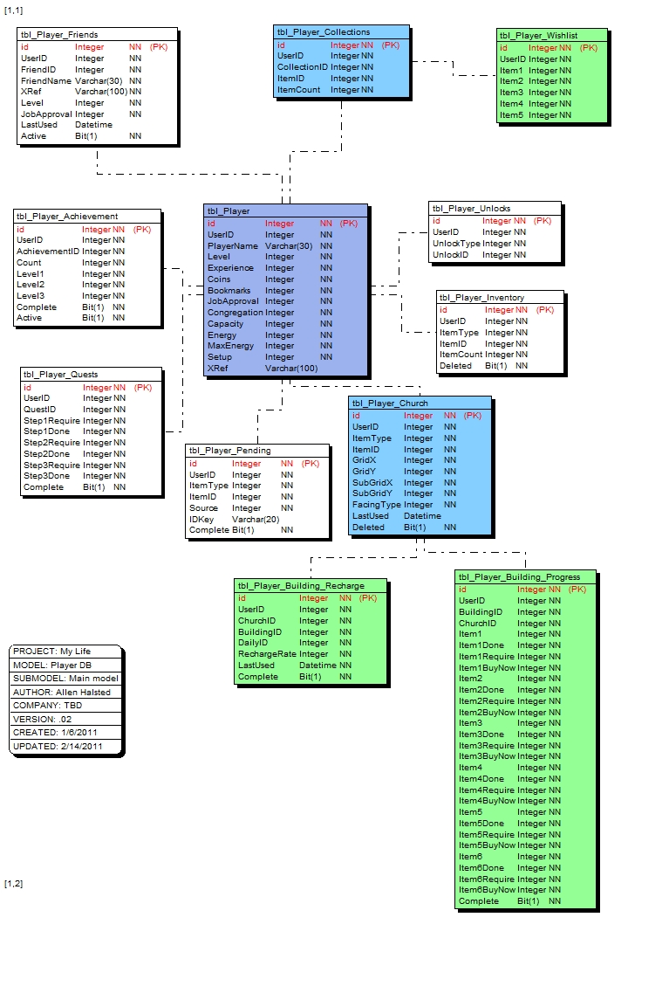
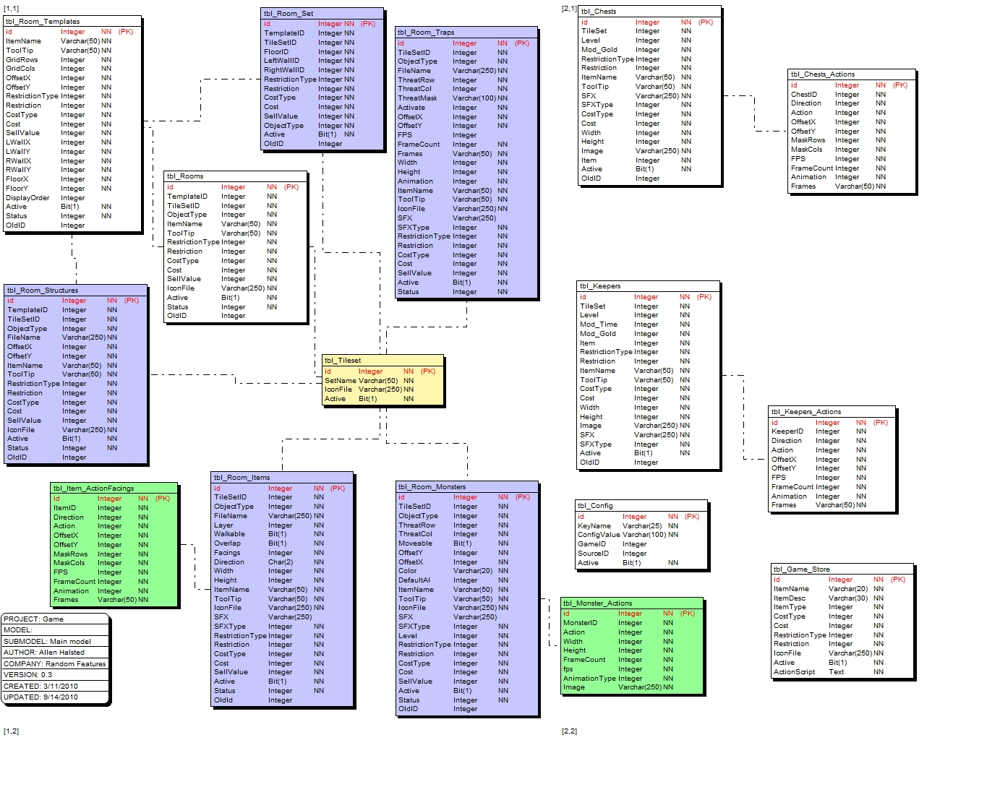
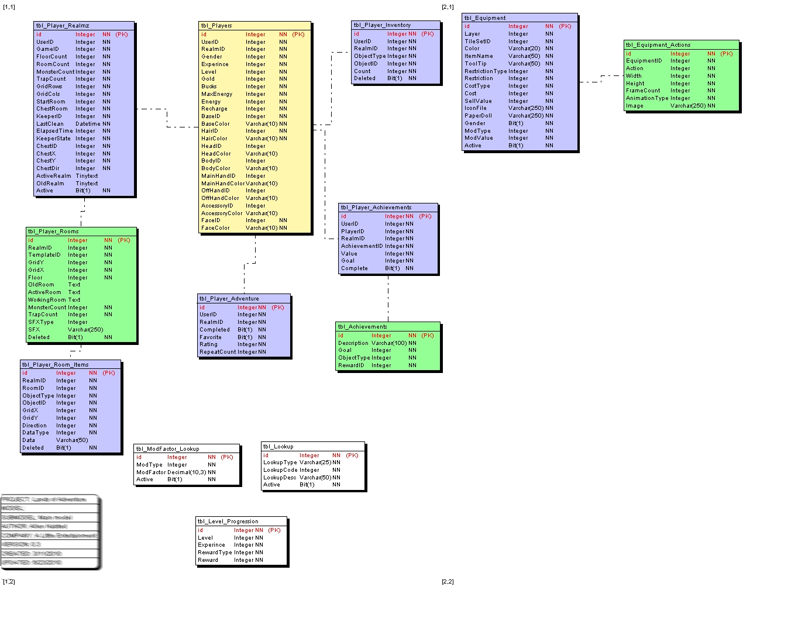
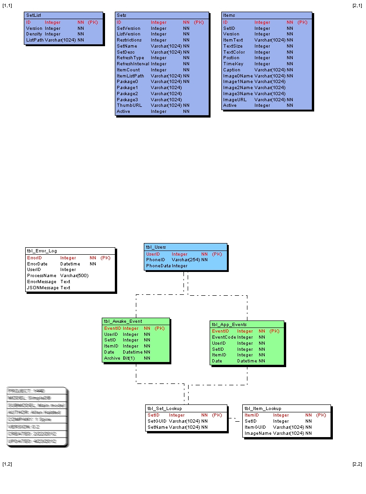

# Database-Schema
I have designed more than a few database schemas in my time. 

## Multiplayer Game System

## Multiplayer Game Account System

## Multiplayer Game Data

## Multiplayer Game Player Data

## Multiplayer Game Data

## Multiplayer Game Data

## Multiplayer Game Player Data

## SimpleDB

